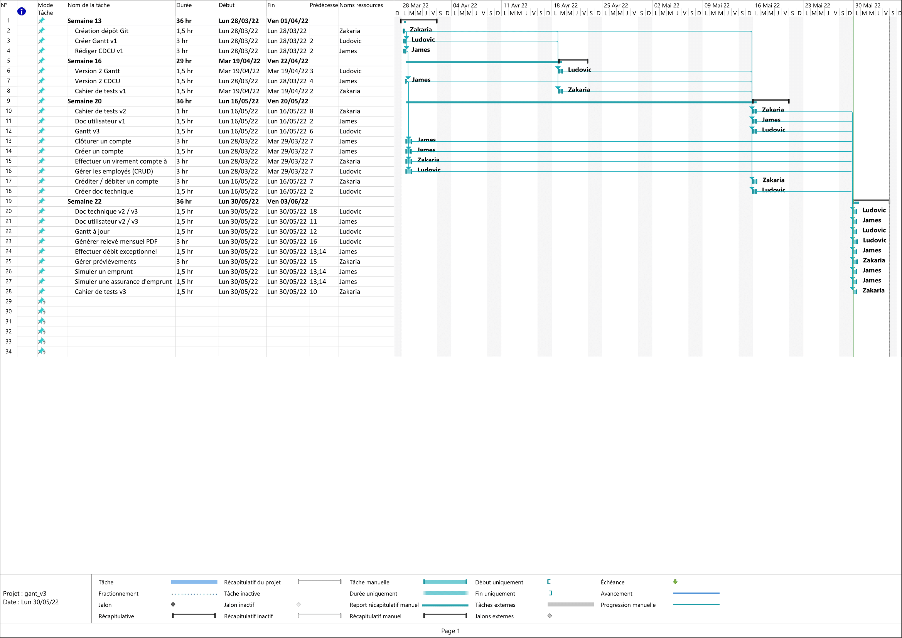

= Application DailyBank

BELKHEIRI Zakaria <zakaria.belkheiri@etu.univ-tlse2.fr> - AimvenDragtow; +
GRASSER James <james.grasser@etu.univ-tlse2.fr> - Darknxss; +
ESTIVAL Ludovic <ludovic.estival@etu.univ-tlse2.fr> - ludovic-estival; +
v3.0

== 1 - Description du projet

=== 1.1 - Contexte
Pour s’adapter aux exigences d’instantanéité de leurs clients, les banques françaises ont accentué leurs efforts de restructuration et leurs investissements dans le digital. Des chantiers longs et coûteux. Par exemple, la Banque Postale a indiqué que sa banque mobile baptisée Ma French Bank sera disponible dans les bureaux de Poste au printemps 2019. Mais les banques ne se contentent pas de créer des offres alternatives : elles rénovent aussi en profondeur leurs services de banque au quotidien.

=== 1.2 - Objectifs
.Repartition des taches et etat d'avancement
[options="header,footer"]
|=======================
|version|user     |use case   |cas...                 |   Zakaria | Ludovic  |  James 

|0    |Chef d'Agence    |CRUD client  | D (Rendre inactif client) | | |F 
|1    |Chef de projet    |CRUD employé  |C| |F | 
|1    |chef de projet    |CRUD employé  |R| |F | 
|1    |chef de projet    |CRUD employé  |U| |F | 
|1    |chef de projet    |CRUD employé  |D| |F | 
|1    |Guichetier     | Compte | Créer| | |F
|1    |Guichetier     | Compte | Créditer/Débiter|F | | 
|1    |Guichetier     | Compte | Effectuer un virement|F | | 
|1    |Guichetier     | Compte | Clôturer| | |F 
|2    |Chef d'Agence     | Compte | Débit exceptionnel| | |F  
|2    |Chef d'Agence     | Emprunt | Simuler emprunt|F | |F  
|2    |Chef d'Agence     | Emprunt | Simuler assurance| | |F 
|2    |Guichetier     | Compte | Relevé PDF| |F |  
|2    |Guichetier     | CRUD Prélèvement | C|F | | 
|2    |Guichetier     | CRUD Prélèvement | R|F | | 
|2    |Guichetier     | CRUD Prélèvement | U|D | | 
|2    |Guichetier     | CRUD Prélèvement | D|F | | 
|3    |Batch     | Prélèvements automatiques | |F | | 
|3    |Batch     | Relevés mensuels | || | 

|=======================

=== 1.3 - Planification dans le temps

== 2 - Organisation du Repository GITHUB

*app* +
[ Executables jar et le jre 1.8 ] +

*code_source* +
[ Code source de l'application ] +

*documentation* +
[ Toutes les documentations du projet ] +

*gestion_projet* +
[ Cahier des charges et Gantt ] +

== 3 - Livrables

[cols="1,2,2,5",options=header]
|===
| Date    | Nom         |  Lien                             | Retour
| 03/04   | Gantt V1    | | L'échelle en jour n'est pas adaptée. L'affectation des tâches dans le GANTT ne correspond par aux ISSUES dans Github. Il manque le détail des tâches de dev pour la V1. EP
|         | CdC V1      | https://github.com/IUT-Blagnac/sae2022-bank-1b2/blob/main/gestion_projet/CDCU/CDCU.v1.adoc[Lien] |   Revoir éléments d'évaluation pour la "page de garde" entête du document. Eviter trop de copier-coller pour la dexcription du contexte et des objectifs.  Pour V0 détailler davantage les rôles de chaque USER. Expliquer l'héritage dans le UC. Pour V1 : Expliquer ce qu'est le CRUD. Expliquer pourquoi on rend inactif un client. Dans les contraintes :  développer les aspects sécurité voir juririque en protection des données. Pour les contraintes orga il manque de nombreux  item  : contraintes de temps : date des livrables, contenu (codes , documentations ...), organisation de l'équipe, outils collaboratifs utilisés ...EP
|         | Suivi Projet | |     Projet correctement créé. Attention les issues ne sont affectées qu'à une seule personne Ludovic en priorité , voir au mieux à 2 (attention aux pseudo pour le travail à l'IUT j'ai besoin d'identifier les contributeurs car la note peut être individualisée qui est darknsxx ? . Que fait le dernier ? Certaines issues devraient être closes (ex. CDCU V1).      EP
| 22/04  | CdC V2/V3 final| https://github.com/IUT-Blagnac/sae2022-bank-1b2/blob/main/gestion_projet/CDCU/CDCU.v3.adoc[Lien] |  1,75/2	Le numero de version n'est pas à jour !
1/2	Lien en retard
2/4	Il manque davantage d'éléments contextuels, j'ai trop de copier coller de l'énoncé.  
3,5/4	Il manque qq données techniques sur l'appli V0.
3/4	Bien mais je n'ai pas les règles de gestion pour les fonctionnalités. Il faut prioriser aussi les fonctionnalités à développer. Il faut alléger le UC, en le proposant par version ou par domaine de gestion (crédit, comptes …)
	
4/4	OK
15,25	/20

|         | Gantt V2    |                               |     
|         | Gantt V3 |  https://github.com/IUT-Blagnac/sae2022-bank-1b2/tree/main/gestion_projet/Gantt[Lien]       |     
|         | Doc. Tec. V0 |       |    
|         | Doc User V0    | https://github.com/IUT-Blagnac/sae2022-bank-1b2/blob/main/documentation/doc_utilisateur/v0/doc_util.v0.adoc[Lien]       |
|         | Recette V0  |                      | 
|         | Suivi projet|   | 
| 22/05   | Gantt V2  à jour    |  | 
|         | Doc. Util. V1 | https://github.com/IUT-Blagnac/sae2022-bank-1b2/blob/main/documentation/doc_utilisateur/v1/doc_util.v1.adoc[Lien]        |  Bien !       
|         | Doc. Tec. V1 | https://github.com/IUT-Blagnac/sae2022-bank-1b2/blob/main/documentation/doc_technique/v1/doc_tech.v1.adoc[Lien]               | Il manque la page de garde - Toutes les figures doivent avoir un numéro et un titre et un commentaire - Dans la partie ressources externes,  Il faut indiquer , l’utilisation de java fx … Il faut donc s’assurer que les postes de travail des employés possèdent une JRE 1.8 pour pouvoir faire fonctionner le .jar sans encombre. Voir comment lancer dans le bon environnement → IHM Comment installer l’application pour pouvoir la maintenir : accès à la base  … Archi de l'appli : faire un schéma - .     
|         | Code V1     |        https://github.com/IUT-Blagnac/sae2022-bank-1b2/tree/main/code_source/v1[Lien]            | Pensez à générer et mettre la javadoc. 
|         | Recette V1 |  https://github.com/IUT-Blagnac/sae2022-bank-1b2/blob/main/documentation/cahier_recettes/v1/cahier_recettes.v1.adoc[Lien]                   | 
|         | Gantt V3 à jour   | https://github.com/IUT-Blagnac/sae2022-bank-1b2/blob/main/gestion_projet/Gantt/gant.v3.png[Lien]   | 
|         | `jar` projet |  https://github.com/IUT-Blagnac/sae2022-bank-1b2/raw/main/app/DailyBankV1.jar[Lien]  | 
| 05/06   | Gantt V3 à Jour  | https://github.com/IUT-Blagnac/sae2022-bank-1b2/blob/main/gestion_projet/Gantt/gant.v3.png[Lien]  |  
|         | Doc. Util. V2 | https://github.com/IUT-Blagnac/sae2022-bank-1b2/blob/main/documentation/doc_utilisateur/v2/doc_util.v2.adoc[Lien] |           
|         | Doc. Tec. V2 | https://github.com/IUT-Blagnac/sae2022-bank-1b2/blob/main/documentation/doc_technique/v2/doc_tech.v2.adoc[Lien] |     
|         | Code V2     | https://github.com/IUT-Blagnac/sae2022-bank-1b2/tree/main/code_source/v2[Lien] |
|         | Recette V2  | https://github.com/IUT-Blagnac/sae2022-bank-1b2/blob/main/documentation/cahier_recettes/v2/cahier_recettes.v2.adoc[Lien] |
|         | `jar` projet |  https://github.com/IUT-Blagnac/sae2022-bank-1b2/raw/main/app/DailyBankV2.jar[Lien]    |
|12/06   | Gantt V3 à Jour  |  https://github.com/IUT-Blagnac/sae2022-bank-1b2/blob/main/gestion_projet/Gantt/gant.v3.png[lien]  |  
|         | Doc. Util. V3 | https://github.com/IUT-Blagnac/sae2022-bank-1b2/blob/main/documentation/doc_utilisateur/v3/doc_util.v3.adoc[Lien] |           
|         | Doc. Tec. V3 | https://github.com/IUT-Blagnac/sae2022-bank-1b2/blob/main/documentation/doc_technique/v3/doc_tech.v3.adoc[Lien] |     
|         | Code V3     | https://github.com/IUT-Blagnac/sae2022-bank-1b2/tree/main/code_source/v3[Lien] |
|         | Recette V3  | https://github.com/IUT-Blagnac/sae2022-bank-1b2/blob/main/documentation/cahier_recettes/v3/cahier_recettes.v3.adoc[Lien]  |
|         | `jar` projet |  https://github.com/IUT-Blagnac/sae2022-bank-1b2/raw/main/app/DailyBankV3.jar[Lien] |
|===
