= Documentation technique DailyBank
:toc: macro
:toc-title: Sommaire
:toclevels: 4
:numbered:
:authors: Estival Ludovic | Beilkeiri Zakaria | Grasser James
:appversion: 1.0
:sectnums:
:description: 
:nofooter:

Version 1.0, 18/05/2022

toc::[]

== Presentation de l'application

La version existante de l'application permet à deux utilisateurs de se connecter: un guichetier et le chef de l'agence.
Le guichetier possède moins de droits d'accès que le chef d'agence. Le chef d'agence peut donc faire les mêmes actions mais il a accès à des fonctionnalités supplémentaires.
Les deux utilisateurs peuvent créer un nouveau client et modifer les informations d'un client. Ils peuvent également consulter un compte et le débiter.
Le chef de l'agence a des droits en plus: il peut rendre inactif un client si ce dernier n'a pas effectué d'opérations au cours des 12 derniers mois.
Le guichetier et le chef d'agence peuvent créer un compte et créditer / débiter un compte. 
Ils peuvent aussi clôturer un compte et effectuer un virement de compte à compte.
Le chef de l'agence peut en plus gérer les employés: il peut les créer, consulter leurs informations, les modifier et les supprimer.

L'application utilise JavaFX. Les postes de travail doivent posséder un JRE 1.8. Le JDK 8 est nécessaire, ainsi que le logiciel SceneBuilder pour construire les fenêtres de l'application.

== Architecture

L'application JAVA communique avec une base de données Oracle dans laquelle est stockée toutes les informations des agences: les employés, les clients, les comptes, etc.
L'application se connecte à la base de données et permet de lire et de modifier les informations sur celle-ci.

L'application utilise la librairie jdbc pour permettre la connexion avec le base de données.

Le code de l'application est structuré en packages:

* application
** Fonction main() de l'application

* application.control
** Fonctions associées aux fonctionnalités

* application.tools
** Classes utilitaires

* application.view
** Vues de l'application: contrôleur et fichier xml associé pour chaque fenêtre

* model.data
** Classes correspondant aux tables de la base de données

* model.orm
** Classes permettant d'accéder à la base de données

* model.exception
** Exceptions qui peuvent être levées lors des accès / requêtes sur la base de données 

== Fonctionnalités 

=== Créer un compte (James)

*Partie du Use Case réalisée*

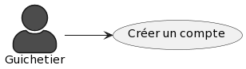

*Parties du diagramme de classe nécessaires*

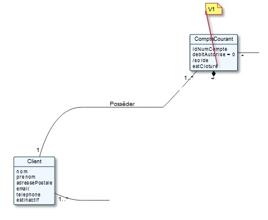

*Captures d'écran de la fonctionnalité*

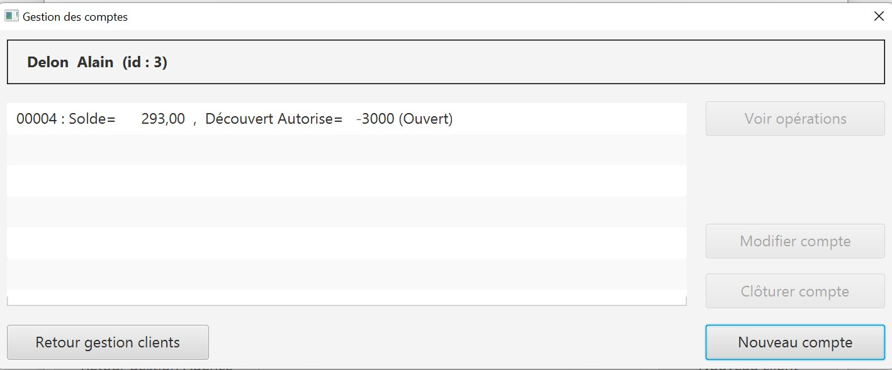
_Fenêtre de la gestions des comptes_

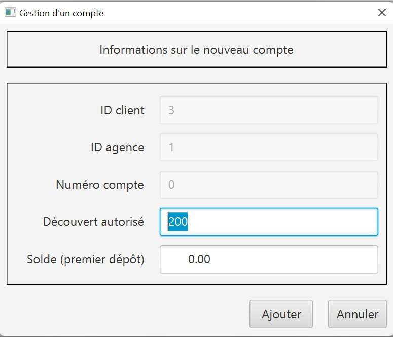
_Fenêtre de la creation d'un compte_ 

*Classes impliquées*

* Package Application.control
** ComptesManagement

* Package Application.view
** ComptesManagementController
** CompteEditorPaneController
** comptesmanagement (fxml)
** compteeditorpane (fxml)

*Package Application.model.orm
** AccessCompteCourant

=== Clôturer un compte (James)

*Partie du Use Case réalisée*

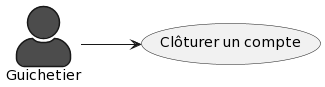

*Parties du diagramme de classe nécessaires*

*Captures d'écran de la fonctionnalité*

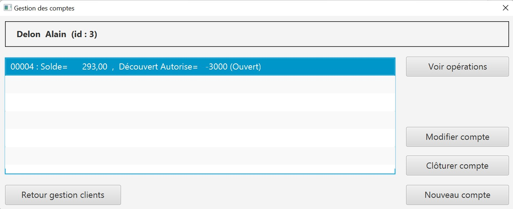
_Fenêtre de la gestions des comptes_

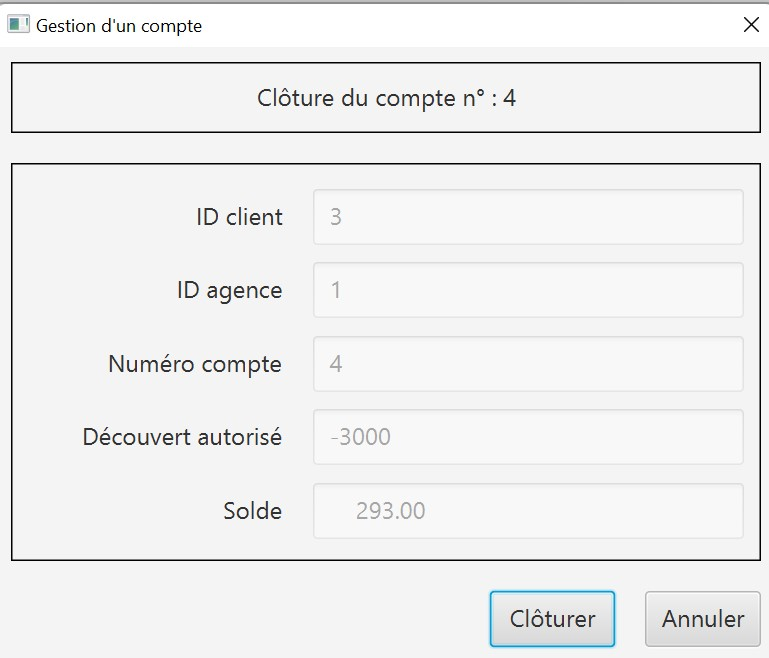
_Fenêtre de la supression d'un compte_

*Classes impliquées*

* Package Application.control
** ComptesManagement

* Package Application.view
** ComptesManagementController
** CompteEditorPaneController
** comptesmanagement (fxml)
** compteeditorpane (fxml)

*Package Application.model.orm
** AccessCompteCourant

=== Créditer / débiter un compte (Zakaria)

*Partie du Use Case réalisée*

image::images/useCaseCredDeb.png[]

*Parties du diagramme de classe nécessaires*

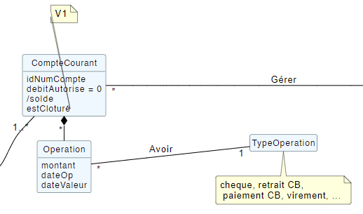

*Captures d'écran de la fonctionnalité*

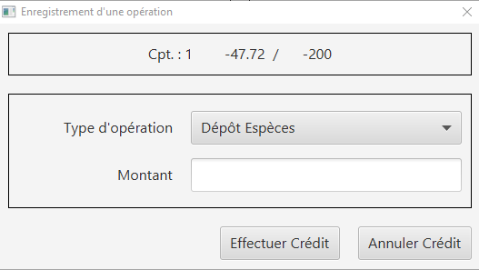

*Classes impliquées*

* Package Application.control
** DailyBankMainFrame
** OperationEditorPane
** OperationManagement

* Package Application.view
** DailyBankMainFrameController
** OperationEditorPaneController
** OperationManagementController
** dailybankmainframe (fxml)
** operationditorpane (fxml)
** operationmanagement (fxml)

* Package Model.orm
** AccessOperation

=== Effectuer un virement de compte à compte (Zakaria)

*Partie du Use Case réalisée*

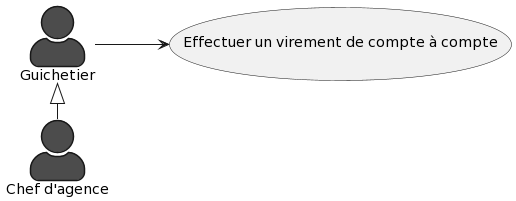

*Parties du diagramme de classe nécessaires*

*Captures d'écran de la fonctionnalité*

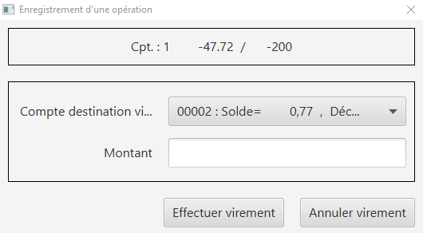

*Classes impliquées*

* Package Application.control
** DailyBankMainFrame
** OperationEditorPane
** OperationManagement

* Package Application.view
** DailyBankMainFrameController
** OperationEditorPaneController
** OperationManagementController
** dailybankmainframe (fxml)
** operationditorpane (fxml)
** operationmanagement (fxml)

* Package Model.orm
** AccessOperation

=== Gérer les employés (CRUD) (Ludovic)

Seul le chef d'agence peut gérer les employés. Il peut consulter la liste des employés et ainsi les modifier ou les supprimer.
Il peut aussi créer un nouvel employé.

*Partie du Use Case réalisée*

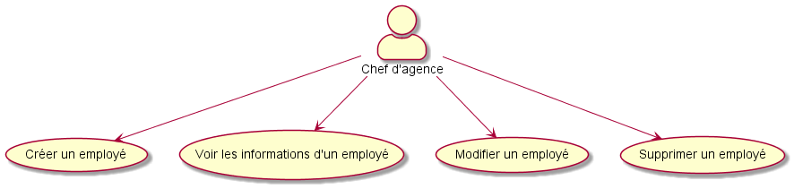

*Parties du diagramme de classe nécessaires*

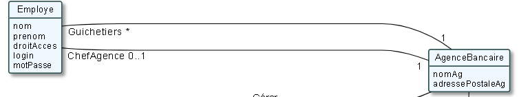

*Captures d'écran de la fonctionnalité*

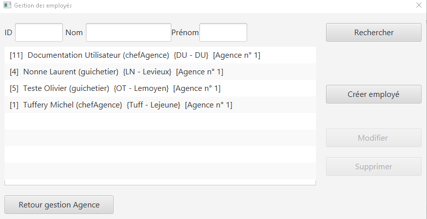
_Fenêtre de la recherche/édition d'un employé_

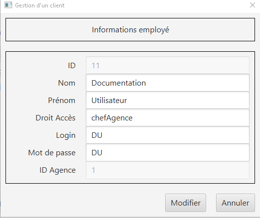
_Fenêtre pour modifier un employé_

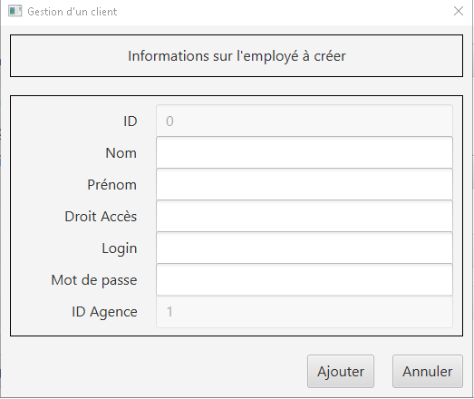
_Fenêtre pour créer un employé_

*Classes impliquées*

* Package Application.control
** DailyBankMainFrame
** EmployeEditorPane
** EmployeManagement

* Package Application.view
** DailyBankMainFrameController
** EmployeEditorPaneController
** EmployeManagementController
** dailybankmainframe (fxml)
** employeditorpane (fxml)
** employemanagement (fxml)

* Package Model.orm
** AccessEmploye

