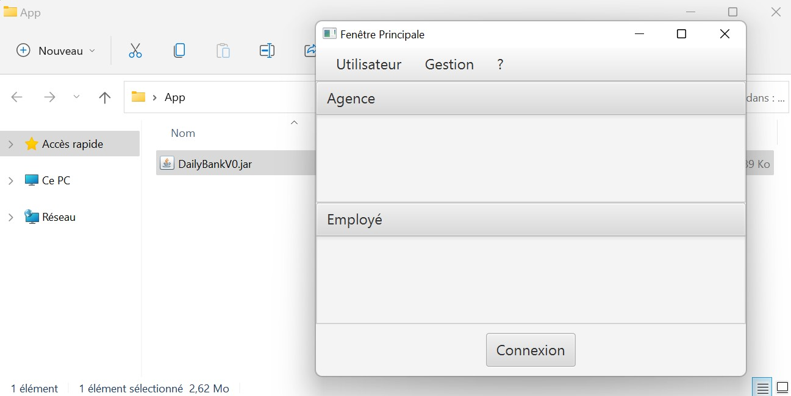
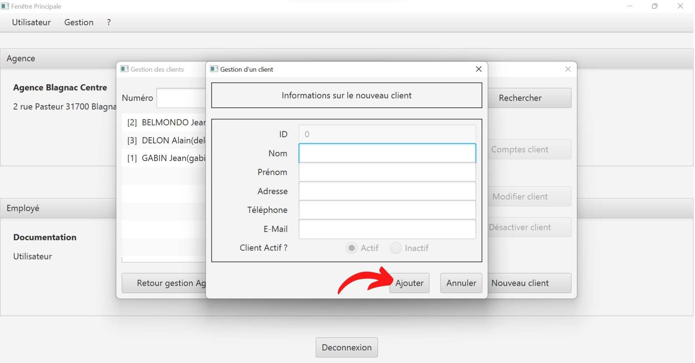
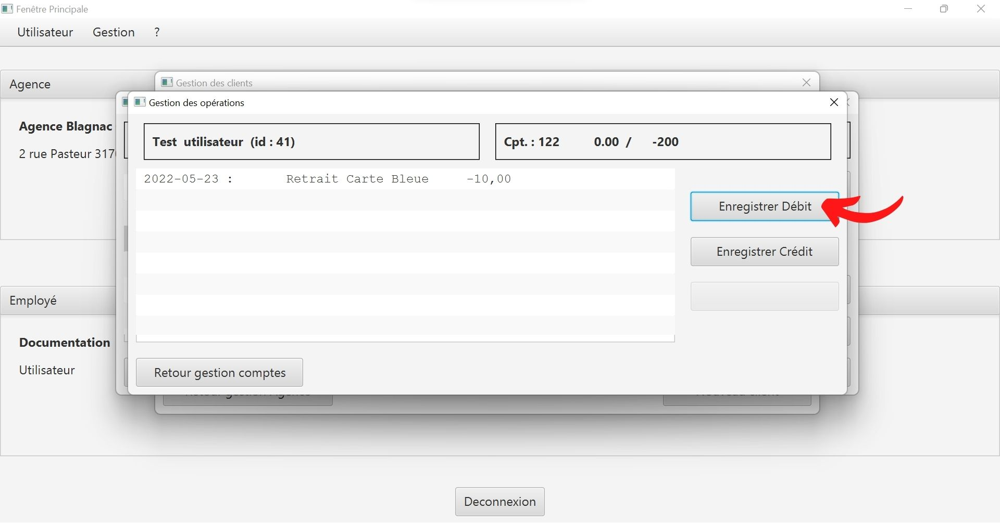

= Documentation Utilisateur v1 : DailyBank
:toc: left
:toc-title: Sommaire
:toclevels: 5
:numbered:
:authors: Estival Ludovic | Beilkeiri Zakaria | Grasser James
:appversion: 1.0
:sectnums:
:nofooter:

Equipe : {authors} +
Version 1, 30/05/2022

== Présentation générale

DailyBank est une application de gestion de comptes bancaires. +
Cette application permet de gérer des comptes bancaires pour des clients. +
Elle permet aussi la gestion des employés dans une agence.

Un guichetier enregistré dans l'application peut : +

* Modifier les informations d'un client

* Créer un nouveau client

* Créer un nouveau compte

* Consulter un compte

* Clôturer un compte

* Créditer/Débiter un compte

Un chef d'agence enregistré dans l'application peut faire les mêmes actions qu'un guichetier et peut aussi : +

* Rendre inactif un client
- Cette fonctionnalité permet de mettre un client inactif si ce client ne s’est pas manifesté ou n’a pas effectué d’opérations sur son compte pendant 12 mois.

* Créer un employé

* Consulter les informations des employés

* Modifier un employé

* Supprimer un employé

== Installation

* link:https://github.com/IUT-Blagnac/sae2022-bank-1b2/raw/main/app/DailyBankV1.jar[Cliquer ici] pour télécharger le fichier .jar de notre application.

* Une fois le jar installé, il est nécéssaire de link:https://github.com/IUT-Blagnac/sae2022-bank-1b2/raw/main/app/jre/jre1.8.0_321.zip[télécharger le JRE] pour pouvoir lancer l'application. Vous avez maintenant 2 fichiers : le .jar et le JRE.

* Extraire les fichiers du fichier .zip à l'aide d'un logiciel de décompression de fichiers (WinRAR, 7-Zip, etc...).

image::img/décompression.jpg[]

* Il ne reste plus qu'à déplacer les fichiers décompressés dans le dossier "Java" dans "C:\Program Files\Java" dans votre explorateur de fichiers. +
Si le dossier "Java" n'existe pas, il est nécéssaire de le créer. 

image::img/déplacementFichiers.jpg[]

* Double cliquer ou lancer simplement sur le fichier .jar pour ouvrir l'application.

== Fonctionnement
=== Fonctionnalités générales
==== Connexion

* Cliquer sur "Connexion" en bas de l'application ou dans le menu "Utilisateur" en haut à gauche de l'application.

image::img/connexion1.jpg[]

* Cliquer sur "Valider" après avoir entré les informations de connexion.

WARNING: Si les identifiants de connexion ne sont pas valides, un message d'erreur apparaît.

==== Deconnexion

* Cliquer sur "Deconnexion" en bas de l'application ou dans le menu "Utilisateur" en haut à gauche de l'application.

image::img/deconnexion.jpg[]

==== Obtenir de l'aide

* Cliquer sur "Aide" dans le menu "?" en haut à gauche de l'application.

image::img/aide.jpg[]

==== Quitter l'application

* Cliquer sur "Quitter" dans le menu "Utilisateur" en haut à gauche de l'application, ou simplement en cliquant sur la croix en haut à droite de l'application.

* Une confirmation apparaît, cliquer sur "OK" pour confirmer la fermeture.

=== Fonctionnalités pour les employés

*[yellow]#/!\ Pour les fonctionnalités suivantes, il est nécéssaire d'être connecté (bouton connexion) sur l'application.#*

==== Gestions des Clients
===== Créer un nouveau client

* Cliquer sur "Clients" dans le menu "Gestion" en haut à gauche de l'application.

image::img/nouveauClient1.jpg[]

* Une nouvelle fenêtre apparaît, cliquer sur "Nouveau client" en bas à droite de la nouvelle fenêtre.

* La fenêtre de creation du client apparaît, remplir les champs et cliquer sur "Ajouter" en bas à droite de la fenêtre.

WARNING: Si un des champs n'est pas valable ou incomplet, un message d'erreur apparaît.

===== Modifier informations client

* Cliquer sur "Clients" dans le menu "Gestion" en haut à gauche de l'application.

image::img/nouveauClient1.jpg[]

* Une nouvelle fenêtre apparaît, cliquer sur "Rechercher" en haut à droite de la nouvelle fenêtre. + 
[green]#*_+++<u>Note :</u>+++_* Il est possible de rechercher un client en entrant son numéro, son nom, ou son prénom.#

image::img/modifierClient2.jpg[]

* La liste des clients apparaît, cliquer sur un client et cliquer sur "Modifier client".

image::img/modifierClient3.jpg[]

* La fenêtre de modification du client apparaît, modifier les champs et cliquer sur "Modifier" en bas à droite de la fenêtre.

WARNING: Si un des champs n'est pas valable ou incomplet, un message d'erreur apparaît.

==== Gestion des Comptes
===== Créer un compte

* Cliquer sur "Clients" dans le menu "Gestion" en haut à gauche de l'application.

image::img/nouveauClient1.jpg[]

* Une nouvelle fenêtre apparaît, cliquer sur "Rechercher" en haut à droite de la nouvelle fenêtre. + 
[green]#*_+++<u>Note :</u>+++_* Il est possible de rechercher un client en entrant son numéro, son nom, ou son prénom.#

image::img/modifierClient2.jpg[]

* La liste des clients apparaît, cliquer sur un client et cliquer sur "Comptes client".

image::img/creerCompte3.jpg[]

* La fenêtre de gestion des comptes du client apparaît, cliquer sur "Nouveau compte" en bas à droite de la fenêtre.

* La fenêtre de creation d'un compte apparaît, remplir les champs et cliquer sur "Ajouter" en bas à droite de la fenêtre.

WARNING: Si un des champs n'est pas valable ou incomplet, un message d'erreur apparaît.

===== Consulter un compte

* Cliquer sur "Clients" dans le menu "Gestion" en haut à gauche de l'application.

image::img/nouveauClient1.jpg[]

* Une nouvelle fenêtre apparaît, cliquer sur "Rechercher" en haut à droite de la nouvelle fenêtre. + 
[green]#*_+++<u>Note :</u>+++_* Il est possible de rechercher un client en entrant son numéro, son nom, ou son prénom.#

image::img/modifierClient2.jpg[]

* La liste des clients apparaît, cliquer sur un client et cliquer sur "Comptes client".

image::img/creerCompte3.jpg[]

* La fenêtre de gestion des comptes du client apparaît, cliquer sur un compte et cliquer sur "Voir opérations" en haut à droite de la fenêtre.

image::img/consulterCompte4.jpg[]

===== Modifier un compte

* Cliquer sur "Clients" dans le menu "Gestion" en haut à gauche de l'application.

image::img/nouveauClient1.jpg[]

* Une nouvelle fenêtre apparaît, cliquer sur "Rechercher" en haut à droite de la nouvelle fenêtre. + 
[green]#*_+++<u>Note :</u>+++_* Il est possible de rechercher un client en entrant son numéro, son nom, ou son prénom.#

image::img/modifierClient2.jpg[]

* La liste des clients apparaît, cliquer sur un client et cliquer sur "Comptes client".

image::img/creerCompte3.jpg[]

* La fenêtre de gestion des comptes du client apparaît, cliquer sur un compte et cliquer "Modifier compte" à droite de la fenêtre.

* La fenêtre de modification du compte apparaît, modifier les champs et cliquer sur "Modifier" à droite de la fenêtre.

WARNING: Si un des champs n'est pas valable ou incomplet, un message d'erreur apparaît.

===== Clôturer un compte

[green]#*_+++<u>Note :</u>+++_* Pour clôturer un compte, il est nécessaire que son solde soit à 0.#

* Cliquer sur "Clients" dans le menu "Gestion" en haut à gauche de l'application.

image::img/nouveauClient1.jpg[]

* Une nouvelle fenêtre apparaît, cliquer sur "Rechercher" en haut à droite de la nouvelle fenêtre. + 
[green]#*_+++<u>Note :</u>+++_* Il est possible de rechercher un client en entrant son numéro, son nom, ou son prénom.#

image::img/modifierClient2.jpg[]

* La liste des clients apparaît, cliquer sur un client et cliquer sur "Comptes client".

image::img/creerCompte3.jpg[]

* La fenêtre de gestion des comptes du client apparaît, cliquer sur un compte et cliquer "Clôturer compte" à droite de la fenêtre.

* La fenêtre de clôture du compte apparaît, cliquer sur "Clôturer" en bas à droite de la fenêtre.

WARNING: Le solde du compte doit être à 0 pour pouvoir le clôturer.

===== Créditer/débiter un compte

* Cliquer sur "Clients" dans le menu "Gestion" en haut à gauche de l'application.

image::img/nouveauClient1.jpg[]

* Une nouvelle fenêtre apparaît, cliquer sur "Rechercher" en haut à droite de la nouvelle fenêtre. + 
[green]#*_+++<u>Note :</u>+++_* Il est possible de rechercher un client en entrant son numéro, son nom, ou son prénom.#

image::img/modifierClient2.jpg[]

* La liste des clients apparaît, cliquer sur un client et cliquer sur "Comptes client".

image::img/creerCompte3.jpg[]

* La fenêtre de gestion des comptes du client apparaît, cliquer sur un compte et cliquer sur "Voir opérations" en haut à droite de la fenêtre.

image::img/consulterCompte4.jpg[]

* La fenêtre de consultation du compte apparaît, cliquer sur "Enregistrer Débit"/"Enregistrer Crédit".

* Une nouvelle fenêtre apparaît, remplir les champs et cliquer sur "Effectuer Débit"/"Effectuer Crédit".

WARNING: Il est important que le compte ne soit pas cloturé pour pouvoir faire cela.

===== Effectuer un virement de compte à compte

* Cliquer sur "Clients" dans le menu "Gestion" en haut à gauche de l'application.

image::img/nouveauClient1.jpg[]

* Une nouvelle fenêtre apparaît, cliquer sur "Rechercher" en haut à droite de la nouvelle fenêtre. + 
[green]#*_+++<u>Note :</u>+++_* Il est possible de rechercher un client en entrant son numéro, son nom, ou son prénom.#

image::img/modifierClient2.jpg[]

* La liste des clients apparaît, cliquer sur un client et cliquer sur "Comptes client".

image::img/creerCompte3.jpg[]

* La fenêtre de gestion des comptes du client apparaît, cliquer sur un compte et cliquer sur "Voir opérations" en haut à droite de la fenêtre.

image::img/consulterCompte4.jpg[]

* La fenêtre de consultation du compte apparaît, cliquer sur "Faire un virement". 

* Une nouvelle fenêtre apparaît, choisir le compte destinataire, choisir le montant et cliquer sur "Effectuer virement".

WARNING: Il est impossible de faire un virement à un compte cloturé.

=== Fonctionnalités supplémentaires pour le chef d'agence

*[yellow]#/!\ Pour les fonctionnalités suivantes, il est nécéssaire d'être connecté (bouton connexion) sur l'application +++<u>et d'être chef d'agence.</u>+++#*

==== Gestions des Clients
===== Rendre inactif un client

* Cliquer sur "Clients" dans le menu "Gestion" en haut à gauche de l'application.

* Une nouvelle fenêtre apparaît, cliquer sur "Rechercher" en haut à droite de la nouvelle fenêtre. + 
[green]#*_+++<u>Note :</u>+++_* Il est possible de rechercher un client en entrant son numéro, son nom, ou son prénom.#

image::img/modifierClient2.jpg[]

* Cliquer sur un client et cliquer sur "Désactiver client" en bas à droite de la fenêtre.

[red]#*_+++<u>Attention :</u>+++_* Pour permettre la désactivation d'un client, il est nécéssaire que tous ses comptes soient cloturés.#

* Une nouvelle fenêtre apparaît, cliquer sur "Rendre inactif" en bas de la fenêtre.

image::img/rendreInactif4.jpg[]

WARNING: Pour pouvoir désactiver un client, il est necssaire que tous ses comptes soient à 0.

==== Gestions des Employés
===== Creer un employé

* Cliquer sur "Employés" dans le menu "Gestion" en haut à gauche de l'application.

* Une nouvelle fenêtre apparaît, cliquer sur "Créer employé" à droite de la fenêtre.

* La fenêtre de création d'un client apparaît, remplir les champs et cliquer sur "Ajouter" en bas de la fenêtre.

WARNING: Si un des champs n'est pas valable ou incomplet, un message d'erreur apparaît.

===== Modifier un employé

* Cliquer sur "Employés" dans le menu "Gestion" en haut à gauche de l'application.

* Une nouvelle fenêtre apparaît, cliquer sur "Rechercher" en haut à droite de la nouvelle fenêtre. + 
[green]#*_+++<u>Note :</u>+++_* Il est possible de rechercher un employé en entrant son numéro, son nom, ou son prénom.#

image::img/modifEmploye2.jpg[]

* Cliquer sur un employé et cliquer sur "Modifier" à droite de la fenêtre.

image::img/modifEmploye3.jpg[]

* La fenêtre de modification d'un client apparaît, remplir les champs et cliquer sur "Modifier" en bas de la fenêtre.

WARNING: Si un des champs n'est pas valable ou incomplet, un message d'erreur apparaît.

===== Supprimer un employé

* Cliquer sur "Employés" dans le menu "Gestion" en haut à gauche de l'application.

* Une nouvelle fenêtre apparaît, cliquer sur "Rechercher" en haut à droite de la nouvelle fenêtre. + 
[green]#*_+++<u>Note :</u>+++_* Il est possible de rechercher un employé en entrant son numéro, son nom, ou son prénom.#

image::img/modifEmploye2.jpg[]

* Cliquer sur un employé et cliquer sur "Supprimer" à droite de la fenêtre.

* Une fenêtre de confirmation apparaît, cliquer sur "OK" pour confirmer la désactivation de l'employé.

