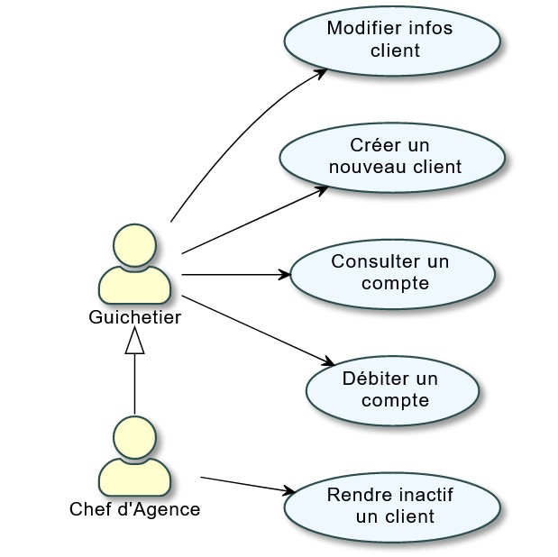
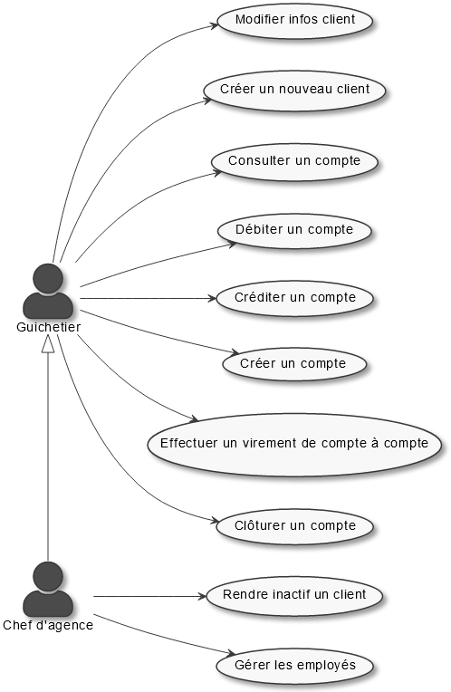

= Cahier des charges : DailyBank
:toc: macro
:toc-title: Sommaire
:toclevels: 4
:numbered:
:authors: Estival Ludovic | Beilkeiri Zakaria | Grasser James
:appversion: 1.0
:sectnums:
:description: 
:nofooter:

Equipe : {authors} +
Version 1.0, 01/04/2022

toc::[]

== Presentation du sujet
{description}

=== Contexte

Pour s’adapter aux exigences d’instantanéité de leurs clients, les banques françaises souhaitent se moderniser et ont accentué leurs efforts de restructuration et leurs investissements dans le digital.

Cela se traduit par des investissements dans la robotisation des tâches automatisables, et dans la modernisation des outils de bureautique pour les guichetiers.

=== Objectifs

La banque DailyBank souhaite développer une application JAVA-Oracle de gestion des comptes clients pour remplacer plusieurs outils obsolètes.

L'objectif est d'améliorer les fonctionnalités déjà présentes dans l'application existante de DailyBank, et de developper de nouvelles fonctionnalités afin d'adapter cette application aux nouveaux besoin des clients, dans le digital.

L’application doit permettre de gérer des comptes bancaires de dépôt pour des clients préalablement créés. Elle devra permettre de débiter, créditer un compte soit par virement c’est à dire un échange d’argent entre deux comptes distincts mais domiciliés dans le réseau bancaire, soit par une personne physique se présentant devant un guichet.

<<<

== Analyse de l'existant

La version `existante` (V0) comporte 2 acteurs pouvant se connecter sur l'application : Un guichetier, un chef d'agence.

-> Le guichetier est l'utilisateur ayant les droits les plus bas pouvant se connecter sur l'application.

-> Le chef d'agence est l'utilisateur ayant les droits les plus hauts pouvant se connecter sur l'application, il a donc les mêmes droits que le guichetier, avec des droits en plus.

=== Les fonctionnalités developpées

.Le guichetier
****
- Modifier informations client (adresse, téléphone, …)
- Créer un nouveau client
- Consulter un compte
- Débiter un compte (BD)
****

.Le chef de l'agence
****
- Modifier informations client (adresse, téléphone, …)
- Créer un nouveau client
- Consulter un compte
- Débiter un compte (BD)
- Rendre inactif un client
* Cette fonctionnalité permet de mettre un client inactif si ce client ne s'est pas manifesté ou n'a pas effectué d'opérations sur son compte pendant 12 mois.
****

=== Diagramme des cas d'utilisation

Les fonctionnalités pour le Chef d'Agence sont les mêmes que celui du guichetier, avec d'autres fonctionnalités en plus. Un héritage dans ce UC est donc présent.

<<<

== Analyse des besoins

La `prochaine` version (V1) doit avoir de nouvelles fonctionnalités en fonction des différents acteurs présents sur l'application.

=== Les fonctionnalités à developper

.Le guichetier
****
[.underline]#Version 1 :# +

- Créditer/débiter un compte (java et BD avec procédure stockée)

- Créer un compte

- Effectuer un virement de compte à compte

- Clôturer un compte
****

.Le chef de l'agence
****
[.underline]#Version 1 :# +

- Gérer (faire le « link:#bookmark-a[CRUD¹] ») les employés (guichetier et chef d’agence)
****

=== Diagramme des cas d'utilisation

<<<

== Analyse des contraintes

=== Contraintes techniques

-> Le langage de programmation (JAVA):: La connaissance et l'utilisation du langage de programmation pour le developpement d'une application est indispensable.

-> La sécurité de l'application:: L'application à développer est une application bancaire, il est donc nécessaire de développer une application sécurisé.
L'identifiant et le mot de passe permettant de se connecter sur un compte de l'application est stocké, il est donc indispensable de ne pas avoir accès à ces données pour sécuriser le compte du client. +
De plus, le règlement général sur la protection des données de l’Union européenne (RPDG) est destiné à renforcer le contrôle des citoyens européens sur les données que les entreprises détiennent à leur sujet. Les données des clients doivent donc avoir une sécurité importante et ne doivent pas être accessible "au public".

-> La prise en main:: Développer une application simple à prendre en main et facile d'utilisation est important pour pouvoir faciliter la gestion des comptes bancaires.

-> L'ergonomie:: Une application bancaire comporte beaucoup de données, il est donc indispensable de développer une application ergonomique, propre, et claire pour permettre au banquier de gérer les comptes bancaires facilement.

=== Contraintes organisationnelles

-> Le choix de l'équipe:: Le choix de l'équipe de travail est important dans la mise en place d'un projet, il est nécessaire de choisir une équipe compétente, dynamique et soudée pour répondre efficacement aux attentes du client.

-> La charge de travail:: La charge liée aux différentes tâches dans projet est une contrainte si elle est mal répartie au sein des membres du projet. Si la répartition des tâches n'est pas efficace, cela impacte directement la qualité du travail, ainsi que sa durée.

-> Le contenu:: Les besoins et les fonctionnalités souhaitées du client doivent être implémentées dans la version finale de l'application proposée dans le temps imparti.

-> Outils collaboratifs:: Pour réaliser le projet, nous utilisons Gantt pour produire un diagramme de Gantt, GitHub pour notre code source et notre documentation. Il est donc nécéssaire de bien connaitre ces deux outils pour pouvoirs les utiliser. +
Pour développer une IHM pour l'application, nous utilisons aussi JavaFX, il est donc également nécessaire de savoir comment créer une IMH en utilisant JavaFX.

-> Le temps imparti:: L'application doit être rendue pour une date précise, la répartition de la charge de travail est donc immportante pour finir le projet à temps. +
Les dates à respecter sont les suivantes : +
- Semaine 13 :
* Gantt version n° 1
* CDCU version n° 1

- Semaine 16 :
* Gantt version n° 2 et n° 3
* CDCU version n° 2 et n° 3
* Cahier des tests version n° 1

- Semaine 20 :
* Gantt (Mise à jour)
* Cahier des tests version n° 2
* Document technique version n° 1
* Document utilisateur version n° 1

- Semaine 22 :
* Gantt (Mise à jour)
* Cahier des tests version n° 3
* Document technique version n° 2 et n° 3
* Document utilisateur version n° 2 et n° 3
* Application version n° 1

- Semaine 23 :
* Application version n°2 et n°3
* Documents livraison finale
* Chiffrage du projet
* Bilan du projet

---
[[bookmark-a]]1. _Create Read Update Delete_